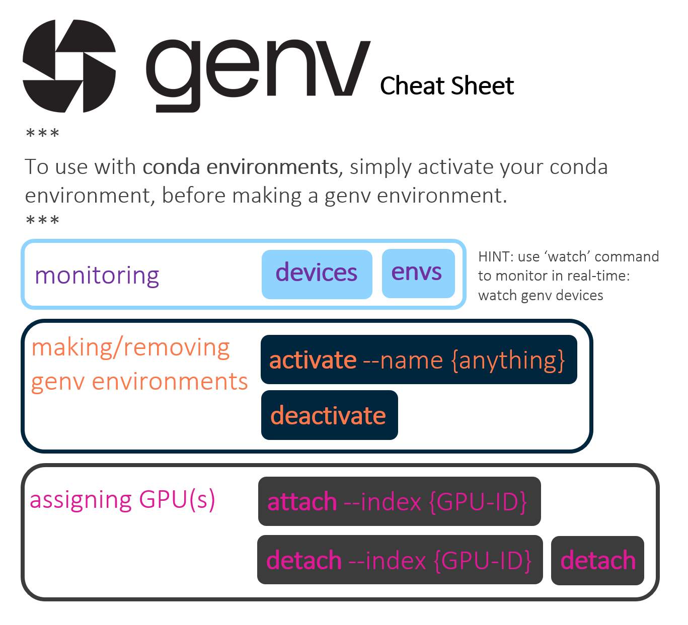

# genv Demo

An intro and live demo of genv, an open-source tool for GPU management.  

Github: [github.com/run-ai/genv](github.com/run-ai/genv)  
Website: g[puenv.com](gpuenv.com)  
Docs: [run-ai.github.io/genv](run-ai.github.io/genv)  
  
The 11-minute video can be found [here](https://youtu.be/_WZR_aO73LU).  
  
Below is an image of the [genv cheat sheet](docs/genv_cheat_sheet.pdf)  
  
  
